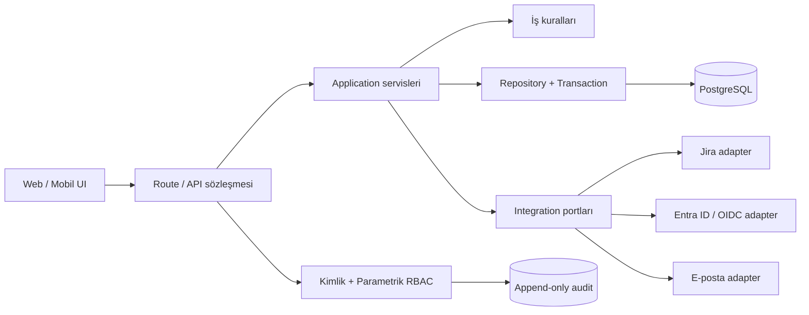

# CRM Hedef Katmanlı Mimari

Bu mimari canlı kullanılan CRM'in kontrollü biçimde büyümesi için referanstır. Yeni modüller aynı sınırları izlemelidir.

## Katman kuralları

- UI, veritabanı veya dış servis çağırmaz. Tipli API client üzerinden işlem yapar.
- Route; JSON doğrulama, auth, permission, correlation ID ve HTTP dönüşümünden sorumludur. İş kuralı içermez.
- Application servis; use-case'i ve transaction sınırını yönetir.
- Domain; framework ve DB bağımsız kuralları taşır.
- Repository yalnız veri erişimi yapar; tablo ayrıntısı route ve UI'a sızmaz.
- Integration adapter; timeout, sınırlı retry, kimlik bilgisi, health check ve dış hata çevirisini tek yerde yapar.
- Migration dışındaki runtime DDL yasaktır.
- Her kritik değişiklik aynı transaction içinde audit kaydı üretir.

## Parametrik RBAC

`rbac_roles`, `rbac_permissions` ve `rbac_role_permissions` yetkinin tek kalıcı kaynağıdır. Kod yalnız bilinen permission anahtarlarını ve güvenli başlangıç varsayılanlarını tanımlar.

1. Kullanıcı oturumdan bulunur.
2. Rolün aktif permission listesi DB'den yüklenir.
3. API permission kontrolü yapar.
4. `*.own` yetkilerinde ayrıca `owner_user_id` doğrulanır.
5. Aynı permission listesi panel menüsüne aktarılır; görünmeyen menü güvenlik sayılmaz, API yine kontrol eder.

RBAC tablosu henüz migration almamış bir instance'ta uygulama geçiş uyumluluğu için güvenli kod matrisine döner. Migration sonrasında DB matrisi geçerlidir. RBAC düzenleme yalnız `super_admin` içindeki `admin.rbac.manage` permission'ıyla yapılır ve audit'e yazılır.

## Parametre sınıfları

- İş listeleri: sektör, entegrasyon tipi, faz adı gibi değerler `system_parameters` içinde yönetilir.
- Yetki: yalnız RBAC tablolarında yönetilir; genel parametre tablosuna karıştırılmaz.
- Secret: Jira tokenı, OIDC secret ve DB parolası secret manager/env içinde kalır; DB parametre ekranında tutulmaz.
- Deployment config: host, issuer, feature flag gibi değerler doğrulanan environment şemasında tutulur.
- Kullanıcı verisi: parametre değildir; ilgili domain tablosunda tutulur.

Silme varsayılan olarak soft-delete/deactivation olmalıdır. Faz geçmişi gibi referans kayıtları fiziksel olarak silinmez.

## Dış servis standardı

Ortak dış HTTP client şu davranışları sağlar:

- varsayılan 15 saniye timeout;
- yalnız güvenli olarak işaretlenen çağrılarda en fazla iki tekrar;
- 429/502/503/504 için kısa exponential backoff;
- normalize sonuç (`ok`, `status`, `attempts`, `durationMs`);
- token, parola ve authorization header loglanmaması;
- yetkili ve sanitize health endpoint'i.

Jira health: `GET /api/admin/integrations/jira/health`. Token veya servis hesabı dönmez; yalnız eksik değişken, host, proje anahtarı ve HTTP durumlarını verir.

## UI standardı

- Her sayfa: başlık + tek cümle amaç + birincil aksiyon + isteğe bağlı filtreler.
- Aynı ekranda birden fazla güçlü birincil buton kullanılmaz.
- Zorunlu alanlar yalnız placeholder ile anlatılmaz; kalıcı label ve gerektiğinde yardım metni kullanılır.
- Boş, yükleniyor, hata ve yetkisiz durumları ayrı bileşenlerdir.
- Masaüstü tablosu mobilde kart/özet listeye dönüşür; kritik aksiyonlar yatay kaydırmanın dışında kalır.
- Rol/permission olmayan kontrol render edilmez; API yine permission doğrular.
- 360/390/768/1024/1440 px ve klavye navigasyonu CI/E2E kapsamına alınır.

## Parametrik ana veri sözleşmesi

- `param_key` ve `value` kanonik kimliktir; oluşturulduktan sonra değiştirilemez. İsim değişikliği yalnız `label` üzerinde yapılır.
- Kullanımdan kaldırma fiziksel silme değil `is_active=false` ile yapılır. Zorunlu gruplarda son aktif değer kapatılamaz.
- Her değişiklik `version`, `updated_by_user_id`, `updated_at` ve merkezi audit kaydı üretir. UI, `expectedVersion` ile kayıp güncellemeyi engeller.
- API, yeni kayıtta yalnız aktif katalog değerini kabul eder. Eski bir pasif değer, kayıt değiştirilmediği sürece okunabilir; yeni kayda kopyalanamaz.
- Kişi ve ekip kimlikleri parametre değildir; `allowed_users.id` / AD subject ve ekip üyeliği tablolarıyla yönetilir.
- Müşteri davranışı sektör veya sorumlu metninden türetilmez. `customer_type` ve `pipeline_policy` açık, parametrik politikalardır.
- Durum makinesi kodları, güvenlik sabitleri ve entegrasyon protokolü enumları keyfi parametre yapılmaz; tipli domain sözleşmesi olarak kalır. Yalnız görünen etiketler ve izin verilen iş seçenekleri parametriktir.
- Entegrasyon kapıları eksik parametrede kapalı (`fail closed`), sayfalama gibi UX ayarları güvenli varsayılana (`safe default`) düşer.
